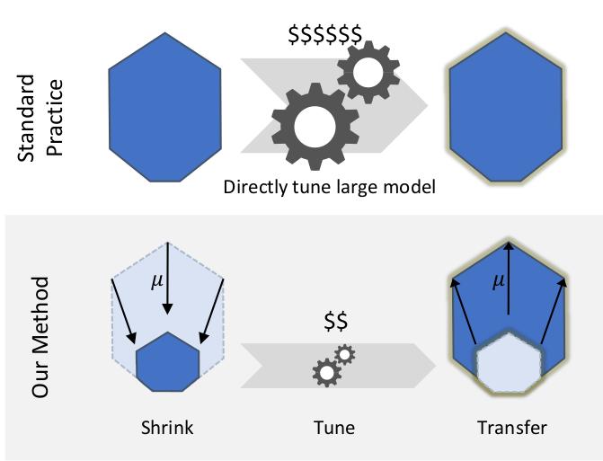
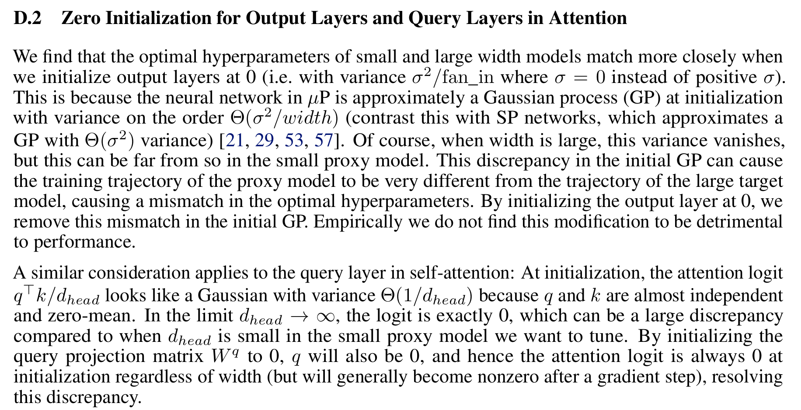
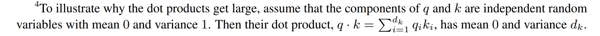
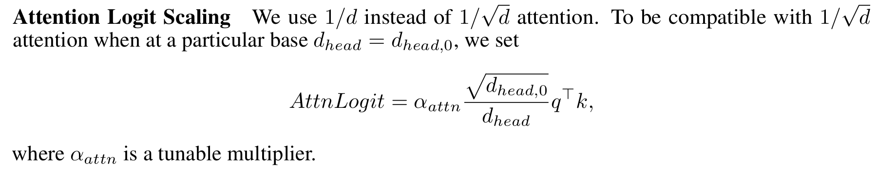
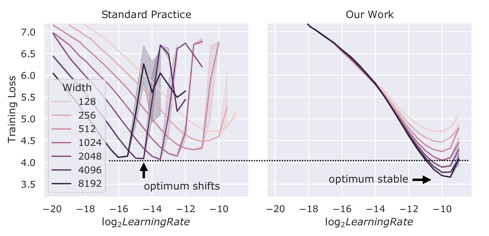

# Practitioner's guide to µP (maximum update parametrization)

The "tensor programs" series of papers by [Greg Yang](https://scholar.google.com/citations?user=Xz4RAJkAAAAJ&hl=en) et al (5 papers in total) that introduced µP/µTransfer are very heavy in math. This is an attempt to demystify the work somewhat and make it easier to implement µP in your own codebase as well as to understand the implementation in llm.c!

## What is µP/µTransfer?

On a high-level µP is a principled way of initializing the weights, scaling activations, learning rate, etc. that provides you with theoretical guarantees that:
* your hyper-parameters (HPs) won't cause your training dynamics to explode as you scale up (even in the limit as you scale to infinity)
* your network will continue to learn useful representations and monotonically improve as you add additional capacity

In practice this means you can find optimal HPs once on a small ("proxy") model that's cheap/fast to train, and you're subsequently guaranteed that those same HPs will be optimal even as you scale up. This is what is known as **µTransfer**:

The theory covers you as you scale across the "width" dimension (can be defined in many ways, e.g. number of heads in a transformer assuming you fix the head dimensionality) but they empirically show that the scaling also works across depth, batch size, seq length, etc.:

Historically, before this series of papers was published researchers approached initialization in a semi-haphazard way*: add sqrt(2), divide by fan in, divide by sqrt of fan in, or maybe fan out? multiply by sqrt(5). You get the point.

[*most methods have some background explanation for why they do what they do but these are mostly just heuristics]

## How do you implement it?

There are 3 sets of modifications you have to implement:
1) Modify your initialization logic
2) Modify your learning rate/weight decay logic
3) Modify your inference logic

I'll focus only on the transformers here but the theory covers various model families and is very general.

Note on terminology: `width_mult` is the ratio of the target width to base model width. You're free to choose your base model however you like. It should be much smaller than your target model.

### 1 - Initialization

1) Modify the `std` of Gaussian used to init attention (QKV and out projection matrix) and MLP weights by multiplying it with 1 / sqrt(`width_mult`). The intuition here is that as you increase the width you want to reduce the size of your parameters such that the dot products (variance) don't explode.
2) Initialize Q (query) matrix to zero.
3) Initialize output layer to zero (if input/output embeddings are tied in that case both will be zero).

Through coordinate check tests (see below) I found 1) to be very extremely important and 2) & 3) less so.

For a theoretical explanation behind the zeroing see this snippet from the paper:

### 2 - learning rate & weight decay

For attention & MLP weights:
1) Divide the learning rate by `width_mult`. Again the intuition here is that these matrices grow infinitely in both directions and you want to reduce their impact on the training dynamics by taking smaller update steps.
2) Multiply weight decay by `width_mult`. Similarly you want to increase the regularization for these weights.

### 3 - inference

1) Scale query / key dot product by `d` and not by `sqrt(d)`, where `d` is the dimensionality of the head.

The original [transformer paper](https://arxiv.org/abs/1706.03762) authors justified that scalar with this footnote:

The assumption of `q` & `k` being independent random variables is true only at a single training step of your training: at the initialization. After a single gradient update they start becoming more and more correlated and at that point you actually want to scale with `d`.

See this (page 6 of [1]):

2. Similarly multiply the q@k dot product with `attn_mult`. This is a tunable parameter. Setting it to 1. seems to stabilize the coordinate check tests for me.

Page 24 of [1]:

3. Scale the pre-logits by `1/width_mult`.

And that should be it! I like to think of this tutorial as a peer reviewed blog post, if you catch some errors please let me know!

## How do you test your implementation?

Luckily there is a fairly easy way to test whether your µP implementation is correct: the authors call this "coordinate check" or "coord check" for short.

The idea is the following: plot the "activation size" (e.g. mean of the absolute activation values - l1 norm) of all layers of your network for 3, 4 steps as you sweep the width across a broad range. The curves should remain flat and should not explode neither shrink to 0 as the parameters get more and more correlated compared to at initialization.

See this [PR comment](https://github.com/karpathy/llm.c/pull/650#issuecomment-2198342446) for some coord check ablation results.

Finally run some experiments!

Find the optimal HPs for your proxy model and then check whether e.g. learning rate remains stable as you scale up:

You should get something like the plot on the right. Normally with "standard parametrization" you'd get the plot on the left.

That's a wrap! I hope you find this one useful!

### References

* [[code] µP](https://github.com/microsoft/mup) [1]
* [[code] mutransformers](https://github.com/microsoft/mutransformers) [2]
* [[paper] µTransfer](https://arxiv.org/abs/2203.03466) [3]